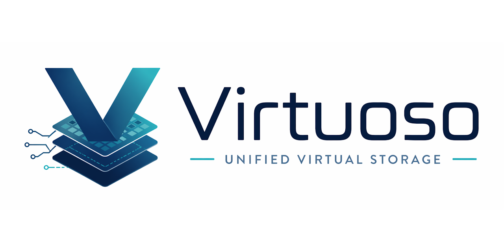

<div align="center">



<br>

[](https://discord.gg/Wb6z8Wam7p) [](https://bsky.app/profile/tinybiggames.com) 

</div>

## What is Virtuoso?

**Virtuoso** is a high-performance, unified memory-mapped storage library for Delphi. It provides one generic class - `TVirtuoso<T>` - that handles anonymous buffers, read-only file views, read-write file views, and copy-on-write mapping through a single API. Thread-safe by default (MREW), with TStream interop, zero-copy sub-views, auto-grow, typed enumeration, and IPC shared memory.

On top of that, **Virtuoso.VFS** adds a read-only virtual file system that packs entire directories into a single `.vpk` archive at build time, then provides instant zero-copy access to any entry at runtime via memory-mapped views - no parsing, no allocation, O(1) lookup.

### Memory-mapped buffer

```delphi
var
  LBuf: TVirtuoso<Integer>;
begin
  LBuf := TVirtuoso<Integer>.Create();
  try
    if not LBuf.Allocate(1000) then
    begin
      WriteLn('Failed: ' + LBuf.LastError);
      Exit;
    end;

    LBuf[0] := 42;
    LBuf[1] := 100;
    WriteLn(LBuf[0] + LBuf[1]);  // 142

    LBuf.SaveToFile('data.bin');
  finally
    LBuf.Free();
  end;
end;
```

### Pack and read a VFS archive

```delphi
var
  LVFS: TVirtuosoVFS;
  LView: TVirtuosoView<Byte>;
begin
  // Pack at build time
  TVirtuosoVFS.PackDirectory('C:\MyGame\Assets', 'assets');

  // Read at runtime
  LVFS := TVirtuosoVFS.Create();
  try
    LVFS.Open('assets');
    LView := LVFS.OpenFile('textures/sky.png');
    try
      // LView.Memory points directly into the archive - zero copy
      WriteLn('Size: ', LView.Size, ' bytes');
    finally
      LView.Free();
    end;
  finally
    LVFS.Free();
  end;
end;
```

## Why Virtuoso?

- **One class, four modes.** Anonymous buffers, read-only file views, read-write file views, and copy-on-write - all through the same API. No decision fatigue.
- **Thread-safe by default.** MREW locking means multiple threads can read concurrently. Only writes serialize. Turn it off entirely for single-threaded hot paths.
- **Typed generic access.** `TVirtuoso<Single>`, `TVirtuoso<Integer>`, `TVirtuoso<TMyRecord>` - the indexer returns your type directly. No casting, no pointer math.
- **TStream interop.** Call `CreateStream()` and hand the result to any Delphi code that consumes TStream - JSON parsers, image decoders, compression libraries - operating directly over mapped memory with zero copying.
- **Zero-copy sub-views.** Slice a region of the mapping into a lightweight view object. No new OS mapping, no allocation - just pointer arithmetic with bounds checking.
- **VFS asset packaging.** Pack hundreds of files into a single `.vpk` archive. Open any entry at runtime with O(1) lookup and zero-copy access. Case-insensitive paths, CRC32 checksums, subdirectory support.
- **Single units, zero dependencies.** Drop `Virtuoso.pas` and `Virtuoso.VFS.pas` into your project. They use only standard RTL and WinAPI units.

## Source Units

| Unit | Purpose |
|------|---------|
| `Virtuoso.pas` | Unified memory-mapped buffer and file class. Anonymous allocation, file-backed mapping (read-only, read-write, copy-on-write), MREW thread safety, TStream adapter, zero-copy sub-views, auto-grow, typed enumerator, IPC shared memory, stream cursor, and error model. |
| `Virtuoso.VFS.pas` | Read-only virtual file system. Packs a directory tree into a single `.vpk` container archive with fixed-size directory, CRC32 checksums, and case-insensitive O(1) path lookup. Opens archives via memory-mapped read-only access and returns zero-copy `TVirtuosoView<Byte>` for each entry. |

## System Requirements

| | Requirement |
|---|---|
| **Host OS** | Windows 10/11 x64 |
| **Building from source** | Delphi 12.x or higher |

## Getting Started

1. Clone the repository
2. Copy `src\Virtuoso.pas` and `src\Virtuoso.VFS.pas` into your project's source path
3. Add `Virtuoso` and `Virtuoso.VFS` to your unit's `uses` clause

```delphi
uses
  Virtuoso,
  Virtuoso.VFS;
```

No packages, no components, no third-party dependencies.

## Documentation

See [docs/Virtuoso.md](docs/Virtuoso.md) for the full API reference, threading guide, features in depth, error codes, and practical examples.

## Contributing

Virtuoso is an open project. Whether you are fixing a bug, improving documentation, or proposing a feature, contributions are welcome.

- **Report bugs**: Open an issue with a minimal reproduction. The smaller the example, the faster the fix.
- **Suggest features**: Describe the use case first. Features that emerge from real problems get traction fastest.
- **Submit pull requests**: Bug fixes, documentation improvements, and well-scoped features are all welcome. Keep changes focused.

Join the [Discord](https://discord.gg/Wb6z8Wam7p) to discuss development, ask questions, and share what you are building.

## Support the Project

Virtuoso is built in the open. If it saves you time or sparks something useful:

- ⭐ **Star the repo**: it costs nothing and helps others find the project
- 🗣️ **Spread the word**: write a post, mention it in a community you are part of
- 💬 **[Join us on Discord](https://discord.gg/Wb6z8Wam7p)**: share what you are building and help shape what comes next
- 💖 **[Become a sponsor](https://github.com/sponsors/tinyBigGAMES)**: sponsorship directly funds development and documentation
- 🦋 **[Follow on Bluesky](https://bsky.app/profile/tinybiggames.com)**: stay in the loop on releases and development

## License

Virtuoso is licensed under the **Apache License 2.0**. See [LICENSE](LICENSE) for details.

Apache 2.0 is a permissive open source license that lets you use, modify, and distribute Virtuoso freely in both open source and commercial projects. You are not required to release your own source code. The license includes an explicit patent grant. Attribution is required; keep the copyright notice and license file in place.

## Links

- [Discord](https://discord.gg/Wb6z8Wam7p)
- [Bluesky](https://bsky.app/profile/tinybiggames.com)
- [tinyBigGAMES](https://tinybiggames.com)

<div align="center">

**Virtuoso™** - Unified Virtual Storage

Copyright &copy; 2026-present tinyBigGAMES™ LLC<br/>All Rights Reserved.

</div>
